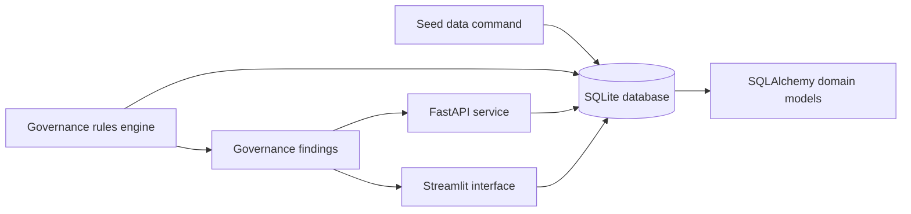
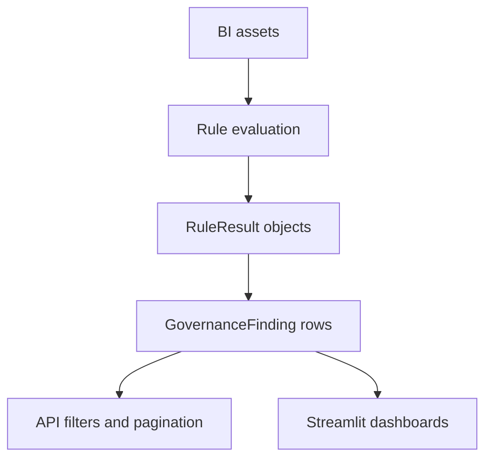

# BI Governance Lab

BI Governance Lab is a local, fictional enterprise BI governance simulator. It models workspaces, users, reports, semantic models, data sources, refresh events, permissions, style checks, accessibility checks, and rule-engine findings.

The project is designed for experimentation, demos, and governance workflow design. It does not connect to real BI platforms and the seed command creates fictional data only.

## Screenshots

Screenshots can be added once the UI is running in your environment.

- Executive Dashboard: `docs/screenshots/executive-dashboard.png`
- Asset Catalog: `docs/screenshots/asset-catalog.png`
- Governance Findings: `docs/screenshots/governance-findings.png`
- Refresh Health: `docs/screenshots/refresh-health.png`

## Architecture





## Project Structure

```text
.
├── .github/workflows/ci.yml
├── docs/
├── src/bi_governance_lab/
│   ├── api/
│   ├── models/
│   ├── schemas/
│   ├── ui/
│   ├── config.py
│   ├── db.py
│   ├── main.py
│   ├── rules.py
│   └── seed.py
├── tests/
├── Dockerfile
├── pyproject.toml
├── requirements.txt
└── README.md
```

## Governance Engine

The rules engine evaluates the local BI asset graph and returns normalized findings. Every finding includes:

- `rule_id`
- `asset_id`
- `asset_type`
- `severity`
- `category`
- `finding`
- `recommendation`
- `evidence`

Implemented rules cover inactive ownership, stale reports, refresh failure rates, stale semantic model refreshes, workspace administrator coverage, missing report descriptions, uncertified semantic models, accessibility scores, and style scores.

Running rules replaces prior rule-engine findings by default, keeping each evaluation cycle easy to reason about.

## Setup

```powershell
python -m venv .venv
.\.venv\Scripts\Activate.ps1
python -m pip install -e ".[dev]"
Copy-Item .env.example .env
```

## Seed Data

```powershell
bi-governance-seed
```

The seed command creates deterministic fictional data:

- 15 workspaces
- 40 users
- 60 reports
- 25 semantic models
- 12 data sources
- 300 refresh events
- permissions, governance checks, and assessment results

## Run Governance Rules

```powershell
bi-governance-rules
```

## Run the API

```powershell
uvicorn bi_governance_lab.main:app --reload
```

Useful endpoints:

- `GET /health`
- `POST /governance/rules/run`
- `GET /governance/findings`
- `GET /governance/findings?category=refresh&limit=25`

## Run the Streamlit UI

```powershell
streamlit run src/bi_governance_lab/ui/streamlit_app.py
```

The UI includes:

- Executive Dashboard
- Asset Catalog
- Governance Findings
- Accessibility Review
- Style Guide Compliance
- Refresh Health
- Workspace Explorer

## Docker

```powershell
docker build -t bi-governance-lab .
docker run --rm -p 8000:8000 bi-governance-lab
```

## Quality Checks

```powershell
ruff format --check .
ruff check .
pytest
```

## Configuration

Settings use the `BI_GOVERNANCE_` environment variable prefix.

| Variable | Default | Purpose |
| --- | --- | --- |
| `BI_GOVERNANCE_APP_NAME` | `BI Governance Lab` | API and UI display name |
| `BI_GOVERNANCE_DATABASE_URL` | `sqlite:///./bi_governance.db` | SQLAlchemy database URL |
| `BI_GOVERNANCE_DEBUG` | `false` | FastAPI debug flag |
| `BI_GOVERNANCE_LOG_LEVEL` | `INFO` | Python logging level |

## Roadmap

- Add Alembic migrations.
- Add authentication and role-based authorization.
- Add persisted rule configuration and rule enablement controls.
- Add finding assignment, remediation workflow, and comments.
- Add import adapters for Power BI, Tableau, Looker, or mock connector payloads.
- Add trend snapshots for governance posture over time.
- Add production-grade observability with metrics, tracing, and structured logs.
